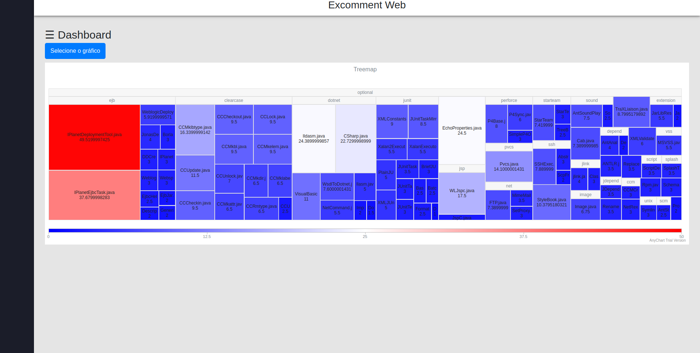
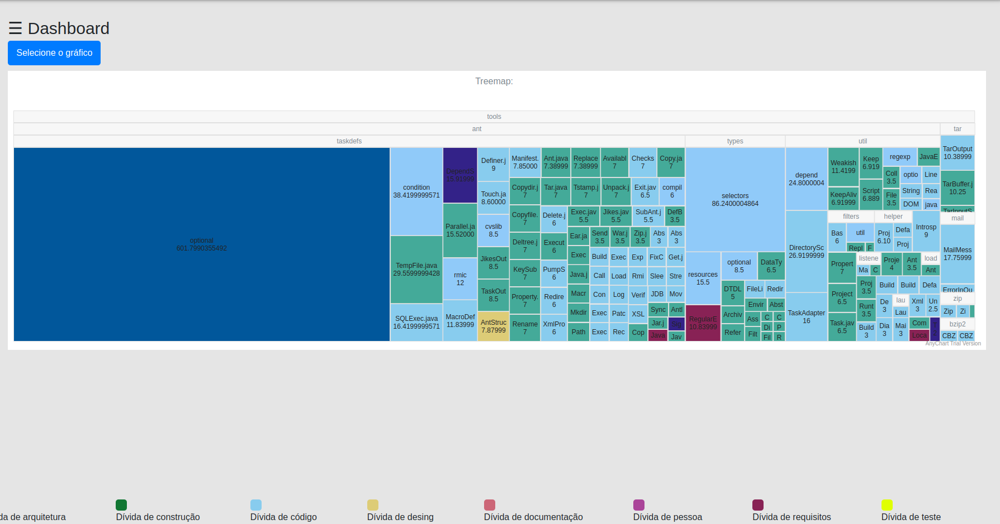

# Excomment Web

## Apresentação do Sistema

Esse é uma ferramenta de visualização dos dados extráidos da ferramenta excomment. A ferramenta disponbiliza alguns modos de visualização, sendo eles.

* Visualização por tipo de dívida
* Visualização pelo score do comentário

OBS: score indica a probalidade de conter dívida técnica naquele comentário

* Visualização por score do comentário

* Visualização por dívida técnica

OBS: Esse sistema de visualização consome uma api que pode ser encontrada <a href="https://github.com/Diogoloiola/api_excomment">aqui</a>

## Instalando o projeto

### Baixando o projeto

    git clone https://github.com/Diogoloiola/excomment-web.git

### Entrando no projeto

    cd excomment-web

### Instalando as dependências

    yarn install

### Executando o projeto
   
    yarn start

Agora é só acessar o seguinte endereço: http://localhost:3001